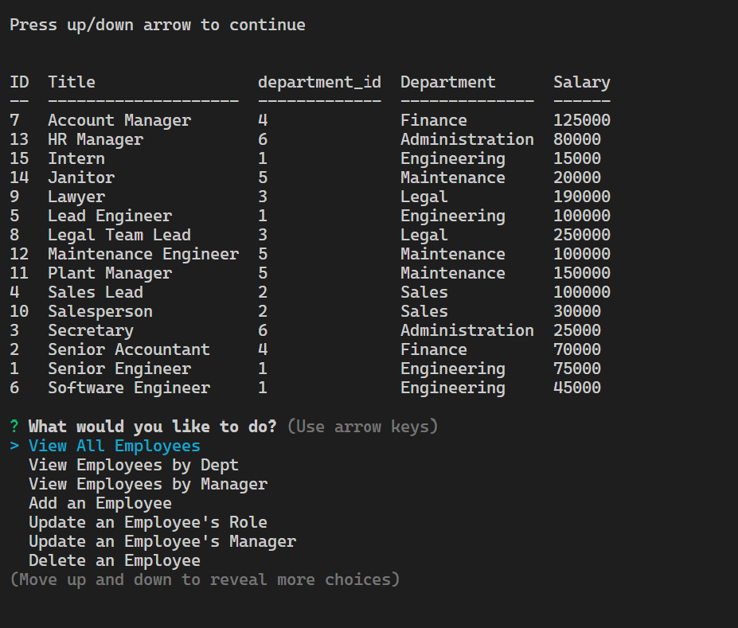

# Employee Tracker CMS  

  

## Description

The application provides access to an SQL employee database via the terminal CLI.

  
## Table of Contents

- [Installation](#installation-notes)
- [Usage](#usage)
- [Features](#features)
- [Credits](#credits)
- [Contributing](#contributing)
- [Questions](#questions)
- [License](#license)

## Installation Notes  

  Clone from Github and retain folder structure.  You will need to update the .env.example file, first by renaming to .env and then by updating with your specific details inside the file.  The name of the database is employees_db.  The database can be created and seeded using the .sql files in the db folder.  From the mysql command line, run SOURCE db/schema.sql, followed by USE employees_db and then run SOURCE db/seeds.sql.  Quit the mysql command line and return to the terminal.  Run node server.js at the command line to start the application.   

## Usage 

  Using the application is relatively simple.  A range of menu items will be presented.  Simply scroll up/down using the cursor up/down keys to the required command and press enter to execute.  The menu will scroll through the options on a loop.  Some options may not be visible at any particular time.  The application provides the opportunity to add or delete departments, roles and employees, although departments and roles cannot be deleted if they are linked to another table, to preserve integrity. If you wish to delete, you will need to reallocate the employees (in the case of roles) or the roles (in the case of departments) that are linked.  Use the Quit command to end the application.  If in doubt at any time, press the up/down arrow to return to the menu.   

  The webpage is located at this address:  https://github.com/Cancer2806/Employee-Tracker-SQL-/

A few screenshots of the application in use are provided below:

## Features  

  The ability to view employees by the Department they are assigned to, or by the Manager that they report to are useful features, as is the ability to view a Departments budget, based on the employees that are allocated to that department.   

## Credits  

  Several packages were useful in the development of this application, including Inquirer, Mysql2, console.table and special thanks are due to the UWA Full Stack Developer Bootcamp under which the application has been developed.   

## Contributing  

  For potential contributions, please contact by email   

## Questions
Questions can be asked by email

Github:  https://github.com/Cancer2806

Email:  frank.lavery@westnet.com.au

## License
This project is licensed under [MIT](https://opensource.org/licenses/MIT).
